# 🧩 [DB Design] Enterprise-Grade Catalog Service Database Schema (PostgreSQL)

## 📌 Context

Database schema design for the **SS-CatalogService** — a scalable microservice catalog module for the SamStore marketplace platform.

---

## 📐 Entity-Relationship Diagram

```mermaid
erDiagram
    brands {
        int id PK
        uuid public_id
        varchar name
        varchar slug
        boolean is_active
    }

    categories {
        int id PK
        uuid public_id
        int parent_id FK
        varchar name
        varchar slug
        int level
        boolean is_active
    }

    products {
        int id PK
        uuid public_id
        int brand_id FK
        int seller_id
        varchar name
        varchar slug
        varchar status
        timestamptz publish_at
        tsvector search_vector
    }

    product_variants {
        int id PK
        uuid public_id
        int product_id FK
        varchar sku
        boolean is_default
        boolean is_active
    }

    product_attributes {
        int id PK
        uuid public_id
        varchar name
        varchar code
        varchar input_type
        boolean is_variant
    }

    attribute_values {
        int id PK
        uuid public_id
        int attribute_id FK
        varchar value
        varchar color_hex
    }

    product_variant_attributes {
        int id PK
        int variant_id FK
        int attribute_id FK
        int attribute_value_id FK
    }

    product_images {
        int id PK
        int product_id FK
        int variant_id FK
        text url
        boolean is_primary
        int sort_order
    }

    product_videos {
        int id PK
        int product_id FK
        text url
        int sort_order
    }

    product_prices {
        int id PK
        int variant_id FK
        varchar price_type
        numeric amount
        char currency_code
        boolean is_active
    }

    warehouses {
        int id PK
        uuid public_id
        int seller_id
        varchar name
        varchar code
        boolean is_active
    }

    product_inventory {
        int id PK
        int variant_id FK
        int warehouse_id FK
        int quantity_on_hand
        int quantity_reserved
    }

    inventory_movements {
        int id PK
        int inventory_id FK
        varchar movement_type
        int quantity
        varchar reference_id
    }

    product_categories {
        int id PK
        int product_id FK
        int category_id FK
        boolean is_primary
    }

    tags {
        int id PK
        varchar name
        varchar slug
    }

    product_tags {
        int id PK
        int product_id FK
        int tag_id FK
    }

    product_seo {
        int id PK
        int product_id FK
        char lang_code
        varchar slug
        varchar meta_title
        varchar meta_description
    }

    category_seo {
        int id PK
        int category_id FK
        char lang_code
        varchar slug
    }

    product_translations {
        int id PK
        int product_id FK
        char lang_code
        varchar name
        text description
    }

    category_translations {
        int id PK
        int category_id FK
        char lang_code
        varchar name
    }

    sellers {
        int id PK
        uuid public_id
        varchar name
        varchar code
        boolean is_active
    }

    seller_products {
        int id PK
        int seller_id FK
        int product_id FK
        boolean is_active
    }

    audit_logs {
        int id PK
        varchar entity_type
        int entity_id
        varchar action
        jsonb old_data
        jsonb new_data
    }

    outbox_events {
        int id PK
        varchar event_type
        varchar aggregate_type
        int aggregate_id
        jsonb payload
        varchar status
    }

    brands ||--o{ products : "has"
    categories ||--o{ categories : "parent_id (self-ref)"
    products ||--o{ product_variants : "has variants"
    products ||--o{ product_categories : "belongs to"
    products ||--o{ product_tags : "tagged with"
    products ||--o{ product_images : "has images"
    products ||--o{ product_videos : "has videos"
    products ||--o{ product_seo : "has SEO"
    products ||--o{ product_translations : "translated"
    products ||--o{ seller_products : "sold by"
    categories ||--o{ product_categories : "contains"
    categories ||--o{ category_seo : "has SEO"
    categories ||--o{ category_translations : "translated"
    tags ||--o{ product_tags : "tagged"
    product_variants ||--o{ product_variant_attributes : "has attrs"
    product_variants ||--o{ product_images : "has images"
    product_variants ||--o{ product_prices : "has prices"
    product_variants ||--o{ product_inventory : "stocked at"
    product_attributes ||--o{ attribute_values : "has values"
    product_attributes ||--o{ product_variant_attributes : "used in"
    attribute_values ||--o{ product_variant_attributes : "assigned"
    warehouses ||--o{ product_inventory : "stores"
    product_inventory ||--o{ inventory_movements : "has movements"
    sellers ||--o{ seller_products : "owns"
    sellers ||--o{ warehouses : "operates"
```

---

## 📦 Migration Files

| File | Scope |
|---|---|
| [001_create_catalog_schema.sql](file:///c:/Users/Jhony%20Samosir/Documents/MyProjects/SamStore/SS-CatalogService/db/migrations/001_create_catalog_schema.sql) | `brands`, `categories`, `products` |
| [002_variants_attributes_media.sql](file:///c:/Users/Jhony%20Samosir/Documents/MyProjects/SamStore/SS-CatalogService/db/migrations/002_variants_attributes_media.sql) | `product_variants`, `product_attributes`, `attribute_values`, `product_variant_attributes`, `product_images`, `product_videos` |
| [003_pricing_inventory.sql](file:///c:/Users/Jhony%20Samosir/Documents/MyProjects/SamStore/SS-CatalogService/db/migrations/003_pricing_inventory.sql) | `product_prices`, `warehouses`, `product_inventory`, `inventory_movements` |
| [004_categorization_seo_i18n.sql](file:///c:/Users/Jhony%20Samosir/Documents/MyProjects/SamStore/SS-CatalogService/db/migrations/004_categorization_seo_i18n.sql) | `product_categories`, `tags`, `product_tags`, `product_seo`, `category_seo`, `product_translations`, `category_translations` |
| [005_sellers_audit_outbox.sql](file:///c:/Users/Jhony%20Samosir/Documents/MyProjects/SamStore/SS-CatalogService/db/migrations/005_sellers_audit_outbox.sql) | `sellers`, `seller_products`, `audit_logs`, `outbox_events`, FTS trigger |

---

## 🔐 Key Design Decisions

| Decision | Rationale |
|---|---|
| `ON DELETE RESTRICT` on products/variants | Prevents accidental data loss in production |
| `ON DELETE CASCADE` on dependent records | Safe for images, translations, seo (orphan cleanup) |
| Internal `id` for all FKs | Integer joins are ~3× faster than UUID |
| `public_id` UUID for API exposure | Prevents ID enumeration attacks (IDOR) |
| Separate `ProductModel` / Domain Entity | GORM tags stay outside the domain layer |
| `search_vector` with GIN index | Enables full-text search on `products` |
| `outbox_events` table | Transactional Outbox pattern — at-least-once delivery |
| `audit_logs` with JSONB snapshots | Full before/after record for compliance |
| Partial indexes `WHERE deleted_at IS NULL` | Up to 80% index size reduction for soft-deleted rows |

---

## ✅ Acceptance Criteria

- [x] All tables follow the mandatory column template (`id`, `public_id`, audit columns)
- [x] ERD is complete and readable
- [x] DDL is executable without modification
- [x] Production-ready indexing strategy (B-Tree, partial, GIN, composite)
- [x] Covers: SPU/SKU, pricing, inventory, SEO, i18n, multi-vendor, events

---

**Owner:** Backend / Data Architecture Team  
**Priority:** High  
**Labels:** `database`, `architecture`, `catalog`, `postgresql`
